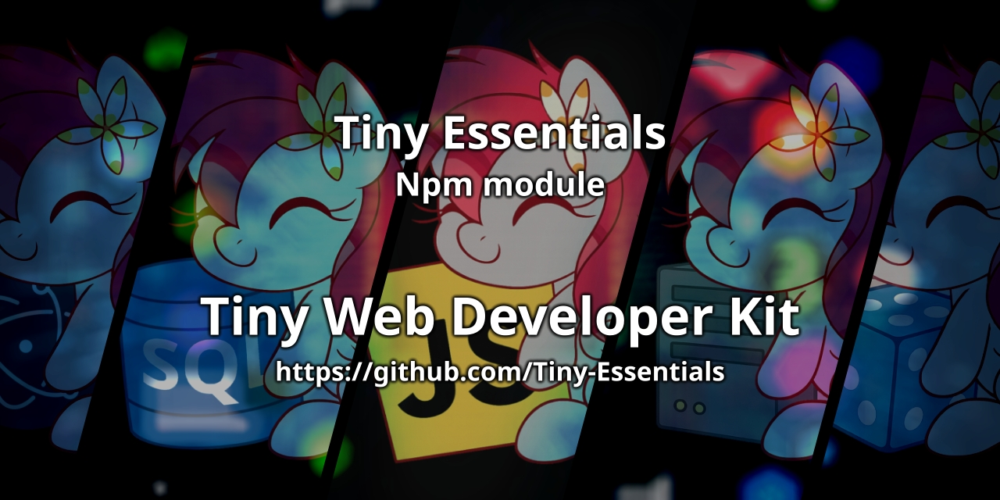

    
    
    
    
    
    

## Welcome

**Tiny-Essentials** is a tiny organization focused on little things that make a big difference in projects, even the tiniest essentials can spark joy, learning, and inspiration. The project was initialized on January 1, 2025, and since that date it has been evolving, receiving more and more new and different features to make developers’ lives easier.

We love simplicity and thoughtful details from tiny tools and experiments to gentle ideas that grow into something special.

This is a place where curiosity is welcome, creativity is encouraged, and every small project matters.

Made with care, patience, and a lot of love 💕

### ✨ AI & Workflow Notes

Curious about how AI fits into our workflow?
Explore our guides on prompts and thoughtful AI usage — all in one tiny place, click [here](../docs).

